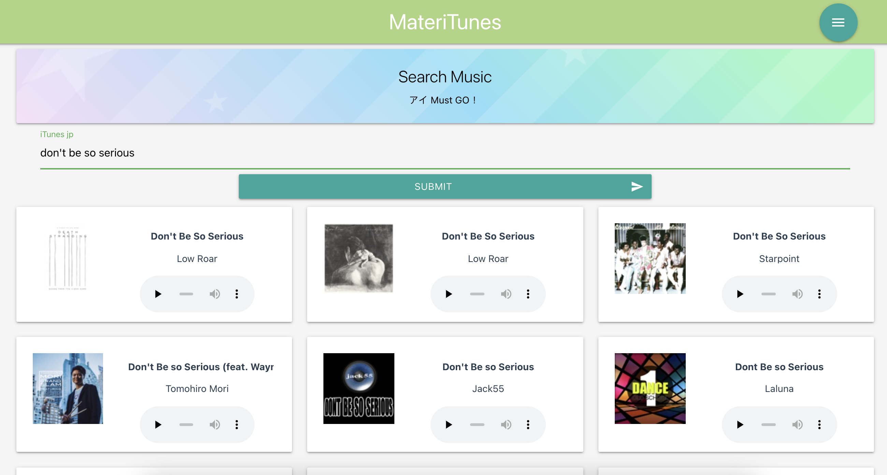

# Search for music in iTunes Store 

A simple reactive webapp (Uncompleted) 

Using [Vue3](https://v3.vuejs.org/) [Vite](https://vitejs.dev/) [WindiCSS](https://windicss.org/) [Materialize](https://materializecss.com/)  [Naive-UI](https://www.naiveui.com/zh-CN/os-theme)  [iTunesApi](https://developer.apple.com/library/archive/documentation/AudioVideo/Conceptual/iTuneSearchAPI/index.html)




## Project setup

```
pnpm install
```

### Compiles and hot-reloads for development
```
pnpm run dev
```

### Compiles and minifies for production
```
pnpm run build
```

### Lints and fixes files
```
pnpm run lint
```

### Customize configuration
See [Configuring Vite](https://vitejs.dev/config/).